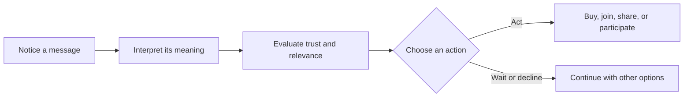

# Chapter 1: Persuasion and Human Decision-Making

Persuasion is the practice of shaping how people notice, interpret, trust, and act on something. It can happen through words, images, layout, timing, color, sound, price, or the order in which choices appear. A designer persuades whenever a design makes one interpretation or action easier to see than another.

That does not make persuasion automatically dishonest. A museum label can persuade a visitor to look more closely. A public-health poster can persuade someone to wash their hands. A product page can help a shopper decide whether an item fits their needs. Persuasion becomes a problem when the communicator hides important information, exploits vulnerability, or removes a person's meaningful ability to choose.

## Persuasion, Coercion, and Manipulation

These ideas overlap, but they are not the same:

| Approach | How it works | What happens to choice? | Example with a white T-shirt |
| --- | --- | --- | --- |
| Persuasion | Gives reasons, signals, or experiences that make an action more appealing | The person can consider the message and decline | Showing the shirt's fabric, fit, price, and a clear reason it may be useful |
| Coercion | Uses force, threats, punishment, or a serious penalty | Choice is restricted by pressure | Saying someone will lose an essential benefit unless they buy the shirt |
| Manipulation | Steers a decision through deception, concealment, or exploitation | The person cannot judge the situation fairly | Calling an ordinary shirt "limited" when there is no real limit, or hiding return costs |

Persuasion respects the audience as a decision-maker. Coercion overrides choice. Manipulation may leave the person technically free to choose, but it distorts the conditions needed for an informed choice. The boundary is not always obvious, so designers should examine both their methods and their effects.

## The Attention-to-Action Journey

Persuasion usually unfolds as a sequence rather than a single magic moment. A person must first notice something, then decide what it means, decide whether to trust it, and finally decide whether to act.

A designer cannot guarantee the final action. People bring their own experiences, goals, identities, budgets, and doubts. Good persuasive design makes a relevant choice understandable; it does not pretend that an audience is a machine with one predictable output.

## Cialdini's Principles of Influence

Robert Cialdini's principles describe common social patterns that can influence decisions. They are not commands and they do not work equally well in every situation. Their ethical use depends on truthful evidence, a relevant offer, and room for refusal.

| Principle | Mechanism | Ethical use | Misuse risk |
| --- | --- | --- | --- |
| Reciprocity | People often feel inclined to return a useful favor | Offer genuinely useful information or a sample with no hidden obligation | Creating a sense of debt to pressure a purchase |
| Commitment and consistency | People tend to value alignment between their actions, words, and self-image | Let people make small, voluntary choices that clarify their real goals | Trapping someone with an earlier choice or public promise |
| Social proof | People look to others' behavior when uncertain | Show honest reviews, participation numbers, or examples from a relevant community | Fake testimonials, purchased reviews, or misleading popularity claims |
| Liking | Familiarity, similarity, and warmth can increase openness | Use a relatable voice and respectful human representation | Using charm or identity cues to distract from weak evidence |
| Authority | Credible expertise can reduce uncertainty | Identify relevant qualifications and explain the evidence | Borrowing prestige, uniforms, or titles without relevant expertise |
| Scarcity | Limited availability can make an option seem more valuable or urgent | State a real deadline or genuinely limited supply clearly | Invented countdowns, false stock limits, or panic-based pressure |
| Unity | A shared identity can create connection and motivation | Build belonging around a real, inclusive shared purpose | Defining an in-group to exclude, shame, or exploit outsiders |

### The White T-Shirt Through These Principles

The shirt itself has not changed, but its presentation can activate different interpretations:

- **Reciprocity:** A clothing store offers a useful guide to caring for cotton garments before presenting the shirt.
- **Social proof:** The product page shows honest feedback from people who describe how the fit worked for them.
- **Authority:** A textile specialist explains the fabric's construction, without pretending that expertise proves the shirt is right for everyone.
- **Scarcity:** The page accurately states that a particular size is nearly sold out, rather than displaying a permanent false countdown.
- **Unity:** A campus organization frames the shirt as part of a shared event or cause, while making clear where the money goes.

These frames can be useful, but they should not replace basic product facts. A compelling story cannot make poor fabric durable, a bad fit comfortable, or an unclear price fair.

## Two More Useful Concepts

### Framing

The framing effect describes how the wording and context around an option can influence how people understand it. The underlying facts may be similar, but different descriptions emphasize different meanings.

For example, the same white T-shirt could be framed as:

- **Practical:** "A washable everyday layer for a small wardrobe."
- **Expressive:** "A blank canvas for personal style."
- **Responsible:** "A repairable staple designed to be worn repeatedly." 
- **Premium:** "A carefully finished white tee with a structured fit."

Framing is not automatically false. It becomes misleading when the frame hides facts that would reasonably change the decision. If a shirt is marketed as a responsible staple, the designer should be able to explain what makes that claim responsible.

### Choice Architecture

Choice architecture is the design of the environment in which decisions are made. Defaults, grouping, labels, sequence, and the number of options can all affect behavior without changing the options themselves.

A T-shirt website might place a clear size guide beside the size selector, make the no-subscription purchase the default, and show the full price before checkout. Those choices make a useful action easier while preserving control. A different site might preselect an unwanted recurring shipment, hide the total until the last screen, or make cancellation difficult. That is still choice architecture, but it uses design to work against the user's interests.

A related idea from behavioral economics is **loss aversion**: people often react more strongly to a possible loss than to an equal possible gain. "Avoid being without a reliable everyday shirt" may feel more urgent than "Gain a versatile everyday shirt." A designer should notice this effect and avoid manufacturing fear merely to increase conversion.

## Ethical Cautions

Before using an influence principle, ask whether the audience can understand the offer and reject it without penalty. Be especially careful when designing for children, people in financial distress, people with limited language access, or anyone making a high-stakes decision.

Some practical safeguards are simple:

- Make important costs, conditions, limitations, and data practices visible before commitment.
- Use urgency only when the deadline or limit is real.
- Label sponsored, paid, or generated endorsements honestly.
- Test whether the design still feels fair when read by someone who does not already trust the organization.
- Provide a clear alternative, cancellation path, or way to say no.
- Check whether the design is helping people reach their own goals or merely making the organization's goal easier.

The white T-shirt is low stakes compared with medical care or financial services, but the same habits matter. A low-stakes dark pattern is still practice for a high-stakes one.

## Questions to Ask Before Trying to Persuade

1. What decision am I asking someone to make, and why might it matter to them?
2. What does the audience need to know in order to make an informed choice?
3. Which part of the design is shaping attention, interpretation, trust, or action?
4. Is every factual claim supported, specific, and easy to check?
5. Am I using social proof, authority, scarcity, or emotion because it is relevant, or because it bypasses careful judgment?
6. Can a person decline, compare alternatives, and change their mind without unnecessary friction?
7. Who might be confused, excluded, pressured, or harmed by this framing?
8. Would I consider the design fair if I were the least informed person seeing it?
9. Does the white T-shirt remain the same product beneath the story, or am I implying that the story changes its physical qualities?
10. What evidence would convince me that the design helped the audience rather than only improving a metric?

## Explore Further

Search suggestions for continued study:

- `Robert Cialdini seven principles of influence primary sources`
- `framing effect psychology examples`
- `choice architecture dark patterns ethics`
- `loss aversion behavioral economics overview`
- `elaboration likelihood model central peripheral routes`
- `persuasion ethics informed consent design`

## What You Should Remember

Persuasion shapes attention, interpretation, trust, and action, but it should leave people able to make a meaningful choice. Cialdini's principles, framing, and choice architecture help explain why design influences decisions. The same white T-shirt can carry different meanings through presentation, yet ethical design keeps the facts visible, avoids manufactured pressure, and treats the audience as people rather than targets.
