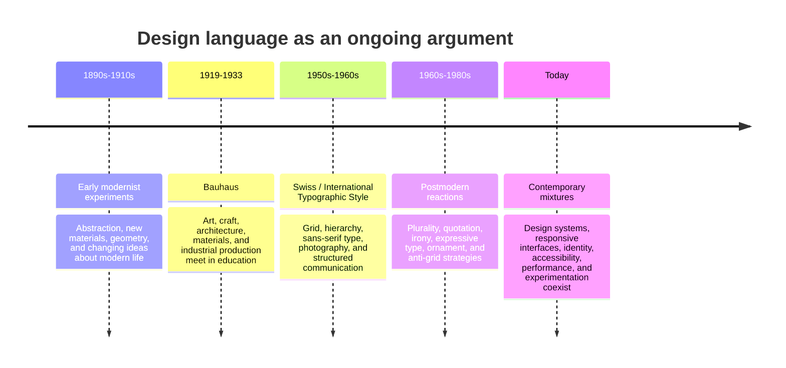

# Chapter 3: Design Language

Visual design carries ideas before we read every word. A typeface can feel official, intimate, technical, or playful. A grid can suggest order and reliability. An unexpected crop can suggest speed, disruption, or uncertainty. Design language is the set of visual choices that makes those ideas recognizable.

Design language is not a universal dictionary. A symbol or style can mean different things in different cultures, periods, and situations. Still, studying design history gives us useful patterns for noticing how form communicates. It also helps us understand why a design feels familiar, serious, rebellious, efficient, luxurious, or strange.

## A Historical Path: Modernism to Swiss Design

In the late nineteenth and early twentieth centuries, industrialization, new technologies, urban growth, and mass communication changed the problems designers faced. Designers were making objects, buildings, posters, publications, and systems for a modern public. Many began looking for forms that fit a machine-shaped world rather than copying historical decoration.

**Early modernism** was not one single style. It included several movements and arguments, but a broad tendency was to emphasize new materials, abstraction, geometry, and the relationship between form and modern life. Some designers reduced decoration to make structure and use more visible. Others used visual experimentation to express the speed and uncertainty of the new century.

The **Bauhaus**, founded in Germany in 1919, connected art, craft, architecture, and industrial production in an educational setting. Its teaching encouraged students to study materials, form, color, and construction rather than treating design as surface decoration alone. Bauhaus work is often associated with geometric forms and functional thinking, but its larger lesson was collaborative problem-solving: design could connect artistic judgment with everyday production.

After the Second World War, the **Swiss Style**, also called the **International Typographic Style**, developed a strong visual language of objective communication. It commonly used a modular grid, sans-serif typography, asymmetrical composition, clear hierarchy, photography, and generous space. The goal was not simply to make things look clean. It was to make information organized, legible, and transferable across languages and contexts.

This tradition gave designers powerful tools: alignments can create relationships, hierarchy can guide attention, and reduction can remove distractions. But every tool also reflects values. The appearance of neutrality may hide decisions about whose language, body, history, or point of view counts as universal.

## Postmodernism as a Reaction and Expansion

From the 1960s onward, many designers and theorists challenged the confidence that one rational, restrained, universal system could organize visual communication for everyone. **Postmodernism** was not a single replacement style, but a broad field of reactions. Designers questioned modernist certainty, restraint, universality, and order through plurality, irony, quotation, historical references, expressive typography, ornament, and deliberate disruption.

A postmodern design might mix typefaces, use a visible collage, distort a grid, revive an earlier style, or make the designer's subjectivity obvious. It might treat visual communication as cultural and political rather than neutral. A design could be intentionally difficult, humorous, excessive, or self-aware.

The important lesson is not that modernism was correct and postmodernism was wrong, or the reverse. Each approach makes some possibilities easier to see and others harder to see. A strict grid can help a reader navigate a complex document, but it can also feel institutional. An anti-grid composition can express identity and energy, but it can also reduce accessibility. Design judgment means understanding the tradeoff.

## The Continuing Tensions

| Tension | One side emphasizes | The other side emphasizes | Contemporary question |
| --- | --- | --- | --- |
| Order and disruption | Stability, sequence, predictability | Surprise, interruption, critique | Should this interface reduce uncertainty or make people pause? |
| Universality and identity | Shared standards and broad legibility | Local voice, difference, and lived experience | Who is included by a supposedly neutral system? |
| Clarity and expression | Fast comprehension and low ambiguity | Mood, personality, and interpretation | What must be understood immediately, and what may be felt gradually? |
| Grid and anti-grid | Alignment, consistency, and relationships | Collision, movement, and emphasis | Does breaking the structure reveal meaning or merely create noise? |
| Restraint and abundance | Fewer elements and controlled attention | Layering, richness, and visual density | Would more information help the audience, or compete for attention? |
| Function and irony | Direct use and dependable purpose | Humor, quotation, and self-conscious commentary | Is the design serving a task, commenting on the task, or doing both? |

These tensions are still active in contemporary web and product design. A banking app may use a restrained grid because people need to find balances and complete tasks accurately. A music platform may use a more expressive and abundant interface because discovery and mood are part of the experience. A civic website may need both: a clear structure for essential information and a visual identity that acknowledges the communities it serves.

The same product team may use modernist and postmodern strategies in different moments. A checkout flow can be orderly while a campaign page is exuberant. A design system can provide consistent components while allowing local content and identity. History continues as a set of choices and disagreements rather than a museum case labeled "finished."

## A Timeline of Arguments

A timeline is useful, but it can make history look too neat. Movements overlap, spread unevenly, and contain internal disagreements. Treat the labels as tools for orientation, not as sealed boxes.

## How to Read a Design

When you encounter a poster, website, package, building, garment, or app, slow down before deciding whether you like it. Read it as an arrangement of choices.

1. **Start with the task.** What is this design asking someone to do, understand, feel, or remember?
2. **Notice the hierarchy.** What do you see first, second, and third? How do size, contrast, position, and spacing create that order?
3. **Look for the structure.** Is there a visible grid? Are elements aligned? Where does the design break its pattern?
4. **Study the typography.** What do the typeface, weight, scale, line length, and spacing suggest? Is the text inviting, authoritative, technical, playful, or difficult?
5. **Examine images and materials.** Are images documentary, symbolic, decorative, ironic, or persuasive? What do color, texture, and motion add?
6. **Ask what is absent.** Whose language, body, history, or experience is not represented? What information is made difficult to find?
7. **Name the tension.** Is the design balancing clarity with expression, or choosing one at the expense of the other?
8. **Consider the context.** Who made it, for whom, when, where, and under what technical or social conditions?
9. **Test the claim.** Does the visual style support the actual function, or does it make a weak experience look impressive?

This method turns "it looks modern" into a more precise observation: perhaps the design uses a modular grid, restrained color, asymmetrical balance, and a clear typographic hierarchy to suggest efficiency and authority.

## The Plain White T-Shirt in Two Design Languages

The physical shirt remains exactly the same: plain white, the same cut, fabric, and price. The presentation changes its implied meaning.

### Modernist presentation

The shirt is shown in a carefully centered or asymmetrically balanced photograph against a plain background. A sans-serif wordmark, restrained color palette, measured spacing, and a clear specification list organize the page. The copy emphasizes construction, fit, durability, and everyday function.

This presentation can make the shirt feel efficient, honest, universal, and dependable. Its visual restraint says that the product does not need decoration to justify itself. The risk is that claims of neutrality may erase cultural identity or make one idea of "the everyday" seem universal.

### Postmodern presentation

The same shirt appears in a collage of contrasting type sizes, references to different visual eras, unexpected crops, handwritten notes, and playful or ironic copy. The page may show the shirt styled in several contradictory ways rather than presenting one ideal user.

This presentation can make the shirt feel expressive, self-aware, culturally situated, and open to reinterpretation. Its abundance says that a simple object can carry many meanings. The risk is that visual play can obscure the price, fit, material, or purchase path.

Neither presentation changes the shirt's physical qualities. One frames simplicity as functional confidence; the other frames simplicity as material for quotation and reinvention. A strong design makes that difference intentional while keeping the practical information available.

## Contemporary Design Is Not Post-History

Digital design makes the old tensions more visible because a single product may contain many layers: a brand identity, a design system, a data model, a responsive layout, an interaction pattern, and user-generated content. The system may need consistency for accessibility and maintenance, while individual screens need flexibility for culture, emotion, or experimentation.

Consider a recipe app. Its navigation may use a strict grid and predictable controls so people can cook without confusion. Its editorial stories may use expressive photography, unexpected type, and local food traditions to create desire and identity. These are not contradictory if each choice serves a recognizable purpose. The challenge is to let expression enrich function rather than interrupt essential use.

The best contemporary work often moves between traditions consciously. It may use modernist clarity for a form, postmodern quotation for a campaign, and inclusive research to question the idea that one visual language works for everyone. Learning design history gives you more choices and better reasons for making them.

## Museum Research

Museum and institutional collections are useful because they let you study authentic examples with information about dates, makers, materials, ownership, and context. Do not assume that a search result or a familiar-looking image is an accurate example. Open the collection record, read the description, and verify the object yourself.

Search the collection sites of institutions such as The Metropolitan Museum of Art, MoMA, Cooper Hewitt, the V&A, Bauhaus archives, national libraries, university collections, or other credible museums and archives. Use searches such as:

- `early modernist poster geometry typography museum collection`
- `Bauhaus typography graphic design archive`
- `Swiss International Typographic Style poster grid collection`
- `modernist graphic design sans serif asymmetrical layout museum`
- `postmodern graphic design expressive typography collage museum`
- `design history anti-grid quotation irony institutional collection`

For each object you find, record the title, maker, date, institution, and collection description. Then ask: What problem was the design addressing? What visual choices create its meaning? Which design tension does it make visible? Does the institution's description support your interpretation, complicate it, or leave questions open?

Do not invent an object name, maker, date, quotation, or URL when you cannot verify it. Search suggestions are a starting point; the collection record is the evidence.

## What You Should Remember

Visual design carries ideas through structure, typography, images, materials, spacing, and context. Early modernism, Bauhaus, and Swiss design developed powerful approaches to function, clarity, and order; postmodern designers challenged the certainty and universality of those approaches through plurality, irony, quotation, and disruption. Contemporary design continues the argument. Read each design by asking what it makes easy to notice, feel, understand, or become, and use history to make choices rather than to follow a style automatically.
