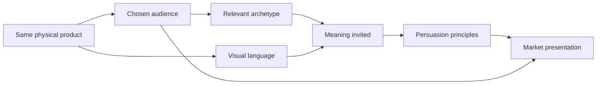

# Chapter 4: One Shirt, Four Stories

Here is the challenge: sell one ordinary high-quality plain white T-shirt four different ways without changing the shirt substantially.

The shirt has the same cut, fabric, color, construction, and price in every concept. No secret technical upgrade appears when we change the headline. What changes is the market presentation: who we imagine buying it, what role the shirt seems to play, how we persuade, and what visual language surrounds it.

This is not a trick. It is a compact demonstration of how branding and design add meaning to a physical object. The customer is never buying only cotton and stitching. They may also be buying confidence, freedom, belonging, discipline, self-expression, or relief from having to decide what to wear. Those meanings can be useful, but they should remain connected to reality.

## The Shared Product

**Product:** an ordinary high-quality plain white T-shirt.

For this exercise, assume the shirt has reliable construction, a comfortable fit, clear care instructions, and an honestly stated price. Every concept must represent those facts accurately. The shirt is the fixed variable. Audience, archetype, persuasion, design language, and story are the variables.

A market presentation is therefore not just a product photo. It is a coordinated answer to several questions: Who is this for? What might this object mean to them? Which visual choices make that meaning legible? Which persuasive signals make the invitation credible? And where could the story become misleading?

## Concept One: The Open Road Tee

### Audience

Students, travelers, and people who want clothing that feels adaptable across changing plans. The audience is not promised a new life by a shirt; it is invited to see the shirt as a dependable companion for an already active life.

### Chosen brand archetype

**Explorer.** The archetype emphasizes curiosity, movement, independence, and the possibility of going somewhere unfamiliar.

### Persuasion principles being used

- **Liking:** A warm, direct voice makes the brand feel like a practical companion rather than a distant authority.
- **Social proof:** Honest customer notes can show how people wore the shirt in different ordinary settings.
- **Commitment and consistency:** A packing checklist or repeat-wear challenge invites a small, voluntary commitment to traveling lighter.

### Visual-design language

Documentary photography, wide crops, natural light, route lines, handwritten annotations, and an interface that feels like a field notebook. The composition leaves room around the person and the landscape. It uses enough structure to remain readable, but it does not look overly polished.

### Headline

**Pack less. See more.**

### Short product story

You do not know exactly what the day will bring: a long walk, an unexpected train, a late meal, or a new neighborhood. This plain white shirt is presented as a simple layer that can move through those plans without demanding attention. Its value is not that it turns someone into an explorer. Its value is that it leaves the story open.

### Imagery direction

Show the same shirt in a sequence of believable situations: folded into a small bag, worn under a jacket, drying after a wash, and layered for a changing day. Avoid pretending that an ordinary T-shirt is waterproof, technical gear, or protective equipment.

### Meaning the customer is invited to buy

The customer is invited to buy **readiness and freedom from overthinking**. The shirt becomes a small symbol of mobility: fewer possessions, more room for experience.

### Ethical concern or possible misuse

Adventure imagery can exaggerate what the shirt can do or imply that buying it is a shortcut to a more interesting life. The campaign should distinguish practical versatility from technical performance and avoid presenting travel as an identity available only through consumption.

## Concept Two: The Essential Form

### Audience

People who value clear information, repeatable quality, and a small, dependable wardrobe. They may be tired of loud product pages and want to compare fit, material, care, and price without decoding a lifestyle performance.

### Chosen brand archetype

**Sage**, with a secondary **Ruler** tendency. The presentation offers knowledge and control rather than excitement.

### Persuasion principles being used

- **Authority:** Explain construction, measurements, and care using specific information rather than vague claims.
- **Consistency:** Use the same information structure for every size and product option.
- **Social proof:** Include clearly labeled, relevant fit feedback instead of celebrity endorsement.

### Visual-design language

A restrained modernist and Swiss-influenced system: modular grid, sans-serif typography, asymmetrical alignment, generous white space, limited color, and a sharply ordered specification panel. The product photograph is direct. The page does not hide essential information behind visual drama.

### Headline

**The shirt, clearly specified.**

### Short product story

Start with the object. Here is the shirt's cut. Here is how it measures. Here is how to care for it. Here is the price. The design does not claim that simplicity is mysterious; it treats simplicity as something worth examining carefully.

### Imagery direction

Use front, back, and detail views on a consistent scale. Show seams, collar, texture, and fit without theatrical cropping. Pair photographs with diagrams or a measured size guide so that the customer can inspect rather than guess.

### Meaning the customer is invited to buy

The customer is invited to buy **confidence through clarity**. The white T-shirt becomes a sign of disciplined choice: a useful object understood before it is purchased.

### Ethical concern or possible misuse

A clean grid can make weak information look authoritative. Technical language can also exclude people who are unfamiliar with clothing measurements. The design must use plain explanations, accessible type, and complete information. "Objective" visual language does not guarantee objective claims.

## Concept Three: The Wrong Shirt for the Right People

### Audience

People who enjoy irony, cultural references, independent fashion, and products that acknowledge their own constructed image. They are not necessarily looking for chaos; they may want an ordinary object presented with enough attitude to become a conversation.

### Chosen brand archetype

**Rebel**, with a **Jester** tendency. The presentation questions the seriousness of conventional fashion advertising while still selling a real shirt.

### Persuasion principles being used

- **Scarcity:** Offer a real, clearly dated release window only if supply is genuinely limited.
- **Liking:** Use humor that creates recognition rather than pretending to be universally funny.
- **Unity:** Invite people into a shared joke without defining outsiders as inferior.
- **Contrast:** Put the plainness of the product against an unexpectedly elaborate campaign so the mismatch becomes the point.

### Visual-design language

Disruptive postmodern composition: clashing type sizes, collage, visible edits, quotation marks, abrupt crops, borrowed visual references, bright color blocks, and an anti-grid that occasionally breaks into a grid just to mock it. The shirt may appear beside annotations such as "seriously plain" or "a blank argument."

### Headline

**This is not a statement. Unless you make it one.**

### Short product story

Fashion often asks a basic object to perform a complicated identity. This shirt refuses to settle the question for you. It arrives plain, then lets styling, context, and the wearer's choices create the noise. The campaign is self-aware about selling simplicity as an attitude.

### Imagery direction

Mix a clean product shot with intentionally awkward snapshots, overprinted type, cropped faces, styling contradictions, and details that look like design decisions caught in the act. Keep the actual product view easy to find so the joke does not become a scavenger hunt.

### Meaning the customer is invited to buy

The customer is invited to buy **permission to play with meaning**. The shirt becomes a blank surface and a critique of the pressure to signal the correct identity.

### Ethical concern or possible misuse

Irony can become a shield for unclear claims, exclusion, or lazy appropriation. A campaign that mocks its audience may confuse cruelty with wit. The design should make the joke legible without hiding cost, fit, return conditions, or who is welcome to participate.

## Concept Four: The Shirt That Makes Room

### Audience

People looking for comfortable, approachable clothing for shared daily life: classes, work, errands, family gatherings, and community events. The audience includes people who do not want fashion expertise to be the price of entry.

### Chosen brand archetype

**Everyperson**, with a **Caregiver** tendency. The meaning centers on belonging, ease, and practical consideration.

### Persuasion principles being used

- **Unity:** Show participation without requiring a narrow status performance.
- **Reciprocity:** Provide a useful care and repair guide with the product.
- **Liking:** Use familiar language and situations rather than polished aspiration.
- **Social proof:** Present varied, specific fit experiences with permission and context.

### Visual-design language

Warm documentary photography, open captions, readable type, practical icons, and a flexible layout that adapts to many bodies and settings. The visual system is friendly without becoming childish. It uses a calm structure, but allows real environments to remain visible.

### Headline

**A little more room for everyone.**

### Short product story

The shirt is not a badge for people who already know the rules. It is a reliable starting point: easy to understand, easy to combine, and present in the ordinary moments that make up a life. The story focuses less on becoming exceptional and more on having one less thing to worry about.

### Imagery direction

Show the shirt in a classroom, shared kitchen, bus stop, workplace, and weekend gathering. Use a range of people and styling choices, but do not claim that one image can represent everyone. Include close views of fit information and accessibility features in the shopping experience.

### Meaning the customer is invited to buy

The customer is invited to buy **belonging without performance**. The shirt becomes a quiet promise that participation does not require status, expertise, or a dramatic personal reinvention.

### Ethical concern or possible misuse

"For everyone" can become an empty slogan if sizing, accessibility, price, imagery, and customer support do not match it. Inclusive-looking photography can also turn real people into decoration. The brand must make practical changes, not only display a welcoming mood.

## Synthesis Table

| Concept | Audience | Archetype | Persuasion principles | Visual language | Meaning invited | Main ethical risk |
| --- | --- | --- | --- | --- | --- | --- |
| The Open Road Tee | Mobile, curious people | Explorer | Liking, social proof, commitment | Documentary, spacious, field-note style | Readiness and freedom from overthinking | Exaggerating performance or selling a lifestyle fantasy |
| The Essential Form | Information-seeking minimalists | Sage / Ruler | Authority, consistency, social proof | Restrained modernist / Swiss-influenced grid | Confidence through clarity | Making incomplete information look objective |
| The Wrong Shirt for the Right People | Irony-friendly, expressive audience | Rebel / Jester | Scarcity, liking, unity, contrast | Disruptive postmodern collage and anti-grid | Permission to play with meaning | Hiding exclusion or product facts behind irony |
| The Shirt That Makes Room | People seeking everyday belonging | Everyperson / Caregiver | Unity, reciprocity, liking, social proof | Warm, accessible documentary system | Belonging without performance | Treating inclusion as a visual claim instead of a practice |

The table shows why "brand identity" is not only a logo. Each concept changes the audience relationship, the persuasive signals, the visual grammar, and the emotional meaning while leaving the shirt itself substantially unchanged.

## What the Exercise Reveals

A product presentation works when its parts support one another. The Explorer concept needs images and language that leave room for movement. The Sage concept needs evidence and structure. The Rebel concept needs a controlled collision between the ordinary product and the unexpected campaign. The Everyperson concept needs accessible information and a believable sense of welcome.

But coherence is not the same as truth. A perfect match between archetype and visual style can make a misleading product feel especially convincing. That is why every concept includes an ethical concern. Persuasion is strongest when it helps people recognize a real benefit, not when it makes a weak product difficult to question.

The same white T-shirt can be a passport, a specification sheet, a joke, or a welcome mat. It is still a white T-shirt. The designer's responsibility is to make the invitation clear enough to understand and honest enough to refuse.

## What You Should Remember

A single physical product can become several market presentations through changes in audience, archetype, persuasion, visual language, and story. The white T-shirt can invite exploration, clarity, rebellion, or belonging without physically changing. Good synthesis makes these choices work together while keeping product facts visible and treating emotional meaning as an invitation, not a guarantee.
