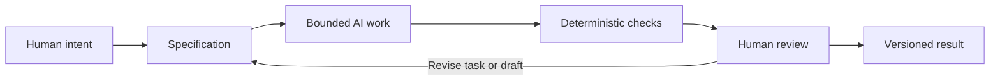

# Chapter 5: Designing the Work, Directing the AI

The first four chapters studied persuasion, brand archetypes, and visual language as ways of shaping meaning. This chapter brings them together and applies them to AI-assisted creative and technical work.

The central idea is simple: before asking an AI system to produce something, decide what the work is meant to do, what it should mean, and how it should feel. These three lenses give you a high-level control framework:

- **Persuasion asks:** What response are we trying to enable?
- **Archetype asks:** What meaning or identity are we expressing?
- **Design language asks:** How should that meaning look and feel?

The framework does not turn AI into an oracle. It helps a human give better direction, inspect the result more intelligently, and decide what deserves to be kept.

## Three Lenses, One Direction

Imagine asking an AI to create a product page for the same plain white T-shirt from Chapter 4. The request becomes more useful when the creative decisions are explicit:

| Lens | Guiding question | White T-shirt example |
| --- | --- | --- |
| Persuasion | What response are we trying to enable? | Help a shopper compare fit and decide without pressure |
| Archetype | What meaning or identity are we expressing? | Sage: careful, informed, and confident through understanding |
| Design language | How should that meaning look and feel? | Restrained grid, clear hierarchy, measured space, direct photography |

Without these decisions, a prompt may produce attractive but directionless output. With them, the AI has a bounded problem to work on. The human still owns the purpose and evaluates whether the result actually serves it.

The lenses can also disagree. A Rebel archetype may invite surprise, while a checkout flow needs clarity. A highly persuasive call to action may improve a metric while damaging trust. Treat those conflicts as design questions, not as reasons to let one lens dominate automatically.

## Why the Specification Matters

A specification is a compact agreement about what the task must accomplish and what boundaries it must respect. It might name the audience, goal, content requirements, tone, format, constraints, acceptance criteria, and things the work must not invent.

An AI task should be bounded because an open-ended request creates too many plausible answers. "Make this better" gives the system no shared definition of better. "Create a one-page Markdown chapter for first-year students, include a comparison table and valid Mermaid diagram, use the white T-shirt example, and do not invent sources" gives both the AI and the reviewer something concrete to work against.

A good specification does several jobs:

- **Focuses effort:** It narrows the space of possible outputs.
- **Protects meaning:** It states the audience and intended response before style takes over.
- **Makes review possible:** It gives the human observable requirements to check.
- **Limits invention:** It identifies facts, sources, formats, and claims that require care.
- **Supports recovery:** It creates a record of what the task was supposed to be.

A specification is not a cage for creativity. It is the frame that lets you tell whether an unexpected idea is useful or merely off-task.

## Why Git Matters

AI-generated work changes quickly. A paragraph can be rewritten, a layout can shift, and a promising version can disappear under a later experiment. Git provides traceability and recovery by recording changes over time.

Traceability means you can inspect what changed, when it changed, and which task or issue motivated it. Recovery means you can compare versions and return to an earlier working state when a new change introduces a problem. Branches and commits make the work legible as a sequence of decisions rather than one opaque final file.

This matters especially when a human is directing an AI system. A commit message can identify the bounded task. A review can discuss the actual diff. A later student can see which parts were generated, revised, rejected, or verified. Version control does not guarantee quality, but it makes quality work easier to inspect and repair.

## Cheap Checks and Careful Review

**Deterministic automated checks** are useful because they repeat the same test and give the same answer when the relevant input has not changed. A script can check that a required file exists, a heading appears, a link points to a real file, or a Markdown structure contains the expected code fence. These checks are cheap, fast, and good at catching omissions.

They are not enough. A file can contain every required heading and still be confusing, misleading, culturally careless, or aesthetically wrong for its audience. Automated checks verify what has been made explicit and machine-readable. They do not replace interpretation.

**AI review** can help identify patterns, suggest revisions, compare a draft to a specification, or point out possible gaps. But it is probabilistic. An AI reviewer can miss a subtle error, confidently suggest an inaccurate claim, or judge a stylistic choice differently on another pass. Treat its feedback as evidence to consider, not as a final verdict.

Human review remains responsible for:

- **Judgment:** deciding whether the result is actually good and fit for purpose.
- **Meaning:** checking whether the work communicates the intended identity and values.
- **Truthfulness:** verifying claims, sources, examples, and representations.
- **Context:** noticing cultural, social, technical, and audience-specific consequences.
- **Final decisions:** accepting, revising, rejecting, or publishing the result.

## The Pit-Stop Principle

Think of an AI-assisted workflow like a race car during a long event. Automation can keep the car moving: generate a draft, run a linter, check a file path, compare a requirement, and report a result. The car should not stop for a person to inspect every rotation of every wheel.

But selected moments deserve a pit stop. A human looks closely when the task is high-impact, the meaning is ambiguous, the result changes direction, a check fails, or the work is about to be shared. During that stop, the reviewer can inspect the actual artifact, compare it with the specification, and make a deliberate decision before the work returns to the track.

The metaphor has a useful limit: speed is not the goal by itself. A fast workflow that carries a false claim or harmful design across the finish line is not successful. The pit stop exists to preserve human judgment at the moments where speed cannot answer the question.

## A Human-Controlled AI Workflow

The loop is intentionally not just a straight line. A failed check may require a small repair. A human review may reveal that the specification was unclear or that the intended meaning has changed. Version control preserves the result and the path that led there.

## A Mini Example

Suppose the task is: "Create a short product page for the white T-shirt for students who want an accessible, low-pressure shopping experience."

1. **Human intent:** Help people make an informed purchase without manufactured urgency.
2. **Specification:** Name the audience, list fit and care information, use an Everyperson/Caregiver direction, require plain language, and prohibit false scarcity claims.
3. **Bounded AI work:** Ask the AI for the page copy and a simple content structure within those limits.
4. **Deterministic checks:** Confirm that price, size guide, return information, required headings, and links are present.
5. **Human review:** Ask whether the tone is genuinely welcoming, whether the images and language imply stereotypes, and whether any claim needs verification.
6. **Versioned result:** Commit the reviewed page with a message that identifies the task and preserves the change history.

The workflow is modest, but its logic scales. The same sequence can guide a chapter, a campaign, a user interface, a script, or a data transformation.

## Questions for Next Week

1. What is one task you could make more precise by writing a short specification first?
2. Which part of a recent AI-generated result required human judgment that an automated check could not provide?
3. What would you want Git to help you recover if an experiment went badly?
4. Which persuasive response should your next design enable, and what response should it avoid?
5. What archetypal meaning or identity should the work express, and is that meaning credible?
6. Which visual language would support the meaning without making the interface harder to use?
7. Where should the next workflow include a deliberate human pit stop?
8. What claim, assumption, or cultural context would you personally verify before publishing?

## What You Should Remember

Persuasion defines the response a design hopes to enable. Archetype defines the meaning or identity it expresses. Design language defines how that meaning looks and feels. In AI-assisted work, a clear specification bounds the task, deterministic checks catch repeatable omissions, Git provides traceability and recovery, and AI review offers useful but fallible feedback. Humans remain responsible for judgment, meaning, truthfulness, context, and final decisions.
